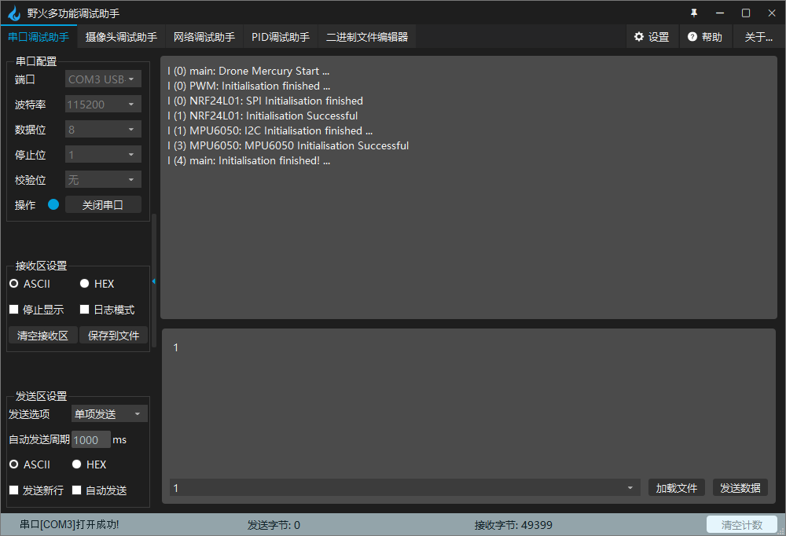
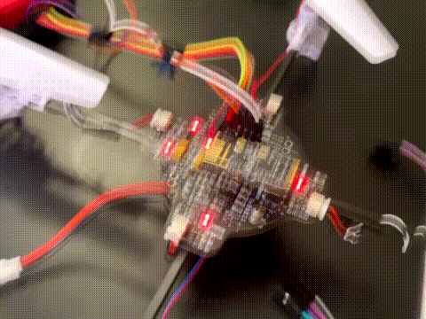

# 
所有程序编译通过,LED3闪烁.
  

  


手柄测试完成，

```c
    dataToSend[5] = joy_left_x_value & 0xFF;
    dataToSend[6] = (joy_left_x_value >> 8) & 0xFF;
    dataToSend[7] = joy_left_y_value & 0xFF;
    dataToSend[8] = (joy_left_y_value >> 8) & 0xFF;
```
